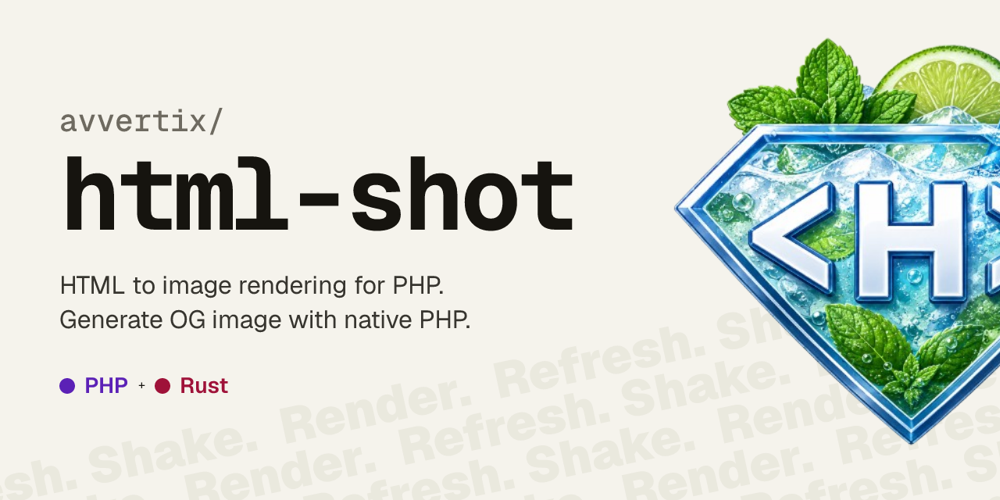

# html-shot

HTML to image rendering for PHP, powered by Rust and [Takumi](https://github.com/kane50613/takumi).
Generate Open Graph images and more from HTML/CSS without headless browser overhead.




## Features

- **No headless browser.** Rendering runs in-process through a native Rust library, so there is no Chromium to install, launch, or keep alive.
- **HTML and CSS in, image out.** Write the layout with the markup and styles you already know; get back raw image bytes ready to stream or save.
- **PNG, WebP and JPEG output**, with adjustable quality for the lossy formats.
- **HiDPI / Retina rendering** via a device pixel ratio, so the same layout can produce 1× and 2× bitmaps.
- **Custom fonts** loaded from a file path or raw bytes, with optional family/weight/style overrides.
- **Reusable contexts.** Load fonts once into a `Context` and reuse it across many renders to avoid reloading on every call.
- **Modern layout.** Takumi's engine supports Flexbox, CSS Grid, `tw` Tailwind utility classes, and CSS animations.


## Installation

**Requirements**

- PHP 8.3 or higher
- FFI extension enabled `ext-ffi`

```bash
composer require avvertix/html-shot
```

The package needs a compiled native library to render images.
Download the one matching your platform and the installed package
version with the bundled console command:

```bash
vendor/bin/htmlshot install
```

This fetches the correct binary from the matching GitHub release, verifies its
checksum, and stores it in the package `lib/` directory.

After upgrading the package, refresh the native library to match the new
version:

```bash
composer update avvertix/html-shot
vendor/bin/htmlshot update
```

> [!NOTE]
> A `natives.lock` file is added to the root of the project. Commit this file to your repo to ensure that each time you'll get the same native version.


## Documentation

- [Getting started](docs/getting-started.md) — install and render your first image
- [Fonts & styles](docs/fonts-and-styles.md) — custom fonts, inline/`<style>`/external CSS, and `tw` utilities
- [Advanced usage](docs/advanced.md) — HiDPI output and using `Context` + `Renderer` directly
- [Examples](examples/README.md) — runnable Open Graph and social-card scripts


## Quick start

The fastest way in is the `HtmlShot` façade. Give it some HTML and a few
options, and it hands back the encoded image bytes:

```php
use HtmlShot\Font;
use HtmlShot\HtmlShot;

$png = HtmlShot::render(
    '<div style="display:flex; width:100%; height:100%; align-items:center;
                 justify-content:center; background:#09090b; color:#fff;
                 font-family:Inter; font-size:64px;">Hello!</div>',
    [
        'width'  => 1200,
        'height' => 628,
        'format' => 'png',
        'fonts'  => [
            Font::fromFile('/fonts/Inter-Regular.ttf', family: 'Inter', weight: 400),
            Font::fromFile('/fonts/Inter-Bold.ttf',    family: 'Inter', weight: 700),
        ],
    ],
);

file_put_contents('card.png', $png);
```

Available options: `width`, `height`, `format` (`png` | `webp` | `jpeg`),
`quality` (1–100 for the lossy formats), `stylesheets` (extra CSS),
`fonts`, and `devicePixelRatio` (e.g. `2.0` for Retina output).


> [!NOTE]
> See the [`examples/`](examples/) directory for deep dive with fonts, custom styles, images and high resolution.


### Reusing a context

The façade loads fonts on every call. When you render repeatedly, build a
`Context` once, load the fonts into it, and drive a `Renderer` directly so the
fonts are parsed a single time:

```php
use HtmlShot\Context;
use HtmlShot\Renderer;

$context = new Context;
$context->loadFontFile('/fonts/Inter-Regular.ttf', family: 'Inter', weight: 400);
$context->loadFontFile('/fonts/Inter-Bold.ttf',    family: 'Inter', weight: 700);

$renderer = new Renderer($context);

foreach ($posts as $post) {
    $html = renderTemplate($post); // your own HTML builder

    // 1× PNG
    file_put_contents("{$post->slug}.png", $renderer->render($html, 1200, 628));

    // 2× WebP for HiDPI displays
    $webp = $renderer->render($html, 1200, 628, 'webp', devicePixelRatio: 2.0);
    file_put_contents("{$post->slug}@2x.webp", $webp);
}
```


## Deep Dive

### How HTML & CSS are handled

html-shot is not a browser, so it treats your markup as a layout description
rather than a full DOM. A few particularities are worth knowing before you
write templates:

- **`<style>` tags** are pulled out of the document and applied as a
  stylesheet, alongside anything you pass through the `stylesheets` option.
- **Inline `style="..."` attributes** are promoted to a generated CSS class
  rule (named `_tk_inline_N`) rather than applied in place, so they behave like
  any other selector. An existing `class` on the element is kept and the
  generated class is appended to it.
- **Images** — both `` and CSS `background-image: url(...)` —
  support local file paths and `data:` URIs. Local paths are read from disk and
  cached up front (Windows backslashes inside `url(...)` are normalised for
  you); `data:` URIs and `http(s)` URLs are passed straight through to Takumi.
- **Inline `<svg>`** is serialized back to SVG markup and rasterized as an
  image, so vector graphics render without a separate conversion step. Its
  `width`/`height` attributes set the image size when present.
- **`<br>`** renders as a newline.
- **`<head>`** is dropped entirely, contents included. **`<html>` and `<body>`**
  are transparent wrappers — they are stripped but their children are laid out.
- **Every other element** becomes a Takumi container node, with its `class`,
  `id`, and `tagName` forwarded so your selectors keep matching. There are no
  special semantics per tag; a `<section>` and a `<div>` lay out the same way,
  and styling is what drives the result.

Because layout is driven entirely by CSS, lean on the engine's Flexbox and CSS
Grid support (plus `tw` Tailwind utilities) to position things — the usual OG
card patterns of centered flex containers and grid feature lists work as you'd
expect.


## Development


```bash
git clone https://github.com/avvertix/html-shot.git
cd html-shot

# Install PHP dependencies
composer install

# Build the Rust library
cd rust && cargo build --release
```


### Build the native library

The Rust library must be compiled for your target platform. A pre-built binary is attached to each GitHub release or you can build your own.

```bash
cd vendor/avvertix/html-shot/rust
cargo build --release
```

Then copy the compiled library to the `lib/` directory at the package root:

| Platform | Source | Destination |
|----------|--------|-------------|
| Linux    | `target/release/libhtml_shot.so`    | `../lib/libhtml_shot.so`    |
| macOS    | `target/release/libhtml_shot.dylib` | `../lib/libhtml_shot.dylib` |
| Windows  | `target/release/html_shot.dll`      | `../lib/html_shot.dll`      |

The C header is auto-generated by cbindgen and written to `include/html_shot.h` during the build.


## Troubleshooting

### Enabling ext-ffi

Check whether FFI is active:

```bash
php -m | grep FFI
```

If it is not listed, add the following to your `php.ini` and restart PHP-FPM / your web server:

```ini
extension=ffi
ffi.enable=true
```

### What is the natives.lock file?

The install writes a `natives.lock` file to your project root (next to
`composer.lock`). It holds the resolved version and the download
URL and checksum of every platform's binary for that release:

```json
{
  "packages": [
    {
      "name": "avvertix/html-shot",
      "version": "v0.1.0",
      "assets": {
        "libtakumi_php.so":    { "url": "…/v0.1.0/libtakumi_php.so",    "digest": "sha256:…" },
        "libtakumi_php.dylib": { "url": "…/v0.1.0/libtakumi_php.dylib", "digest": "sha256:…" },
        "takumi_php.dll":      { "url": "…/v0.1.0/takumi_php.dll",      "digest": "sha256:…" }
      },
      "installed-at": "2026-06-28T08:46:14Z"
    }
  ]
}
```

**Commit this file**: when it is present, `vendor/bin/htmlshot install`
reinstalls exactly the locked version and verifies the download against the
locked checksum, giving deterministic installs across machines and CI.

Because the lock captures every platform's asset, a lock generated on one OS
(e.g. while developing on Windows) lets a build or deployment on a different OS
install the matching binary deterministically and verify it offline.

## Contributing

Contributions are welcome! Please see [CONTRIBUTING.md](CONTRIBUTING.md) for guidelines.

## License

MIT License - see [LICENSE](LICENSE.md) file for details.

## Credits

Powered by [Takumi](https://github.com/kane50613/takumi)
