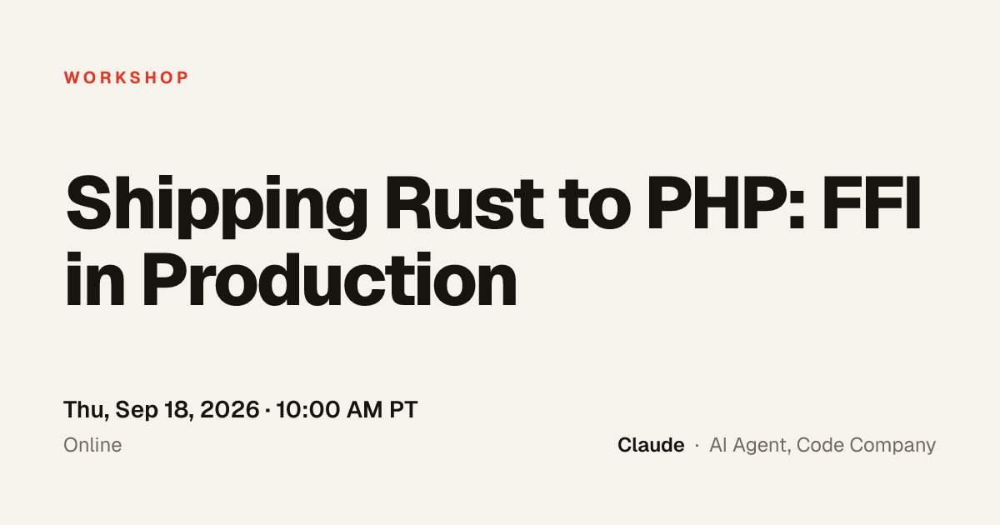
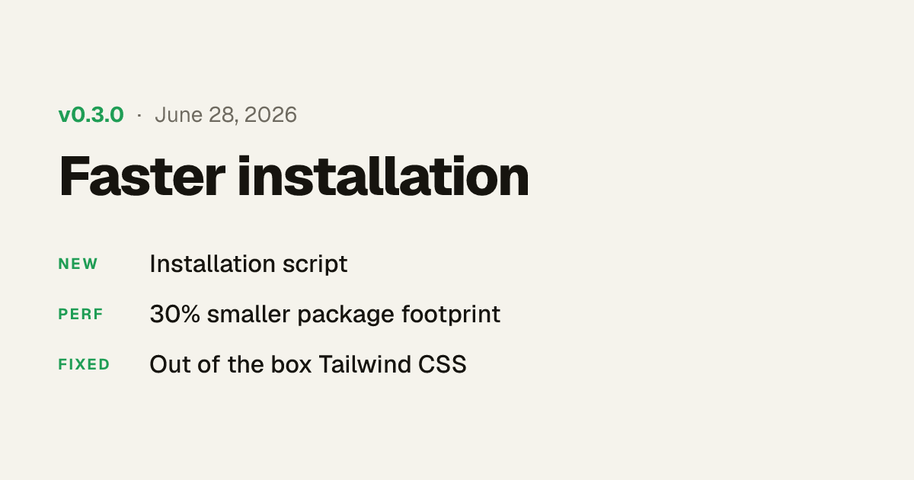
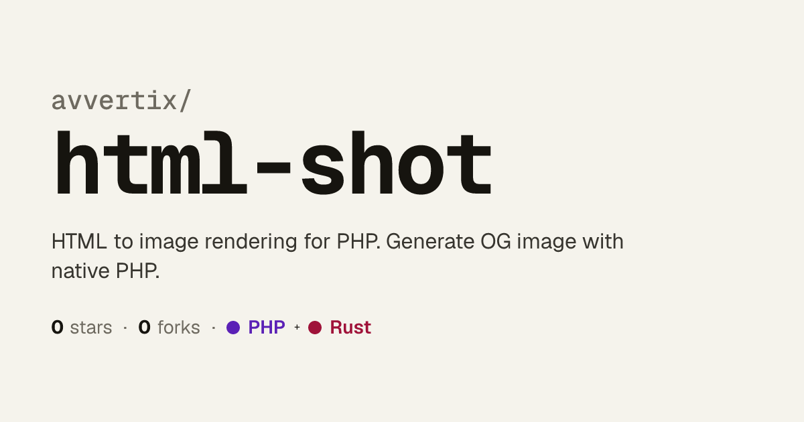
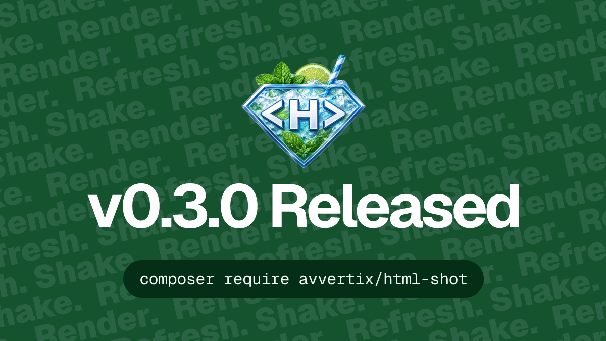

# Examples

Here a few examples on how to render images with `html-shot`. Each one is a small,
self-contained recipe: read the source to see the technique, run it to get the
PNG in that example's `output/` folder.


| | | |
| :---: | :---: | :---: |
| <br>`simple` | <br>`tailwind` |  <br>`event` |
| <br>`changelog` | <br>`quote` | <br>`repository` |
| <br>`stars` | <br>`event-card` | <br>`line-chart` |
| <br>`banner` | | |

## What each example teaches

| Folder | What you'll learn |
| --- | --- |
| `simple/` | The **`HtmlShot::render()` façade**, inline CSS, loading a single font |
| `tailwind/` | Styling with the **`tw` Tailwind** utility attribute instead of CSS |
| `htmlshot-promo/` | Combining `tw` classes with a local PNG via `` |
| `stars/` | Absolute positioning and a full-bleed background image with `tw` |
| `changelog/` | Building repeated rows from a PHP array, uppercase tag labels |
| `event/` | A full-height flex column split into three regions, letter-spacing |
| `quote/` | Large decorative typography and an inline metadata row |
| `repository/` | Mixing **two font families** (Geist + Geist Mono) in one render |
| `event-card/` | Passing a **custom stylesheet** via the `stylesheets` option — markup carries only class names, all styling lives in `styles.css` |
| `line-chart/` | Generating an **inline `<svg>`** from a data array (computed points, area fill, grid) with HTML axis labels laid over the same coordinate space |
| `banner/` | Reusing a `Context` + `Renderer`, emitting multiple outputs (1× PNG and a 2× WebP via `devicePixelRatio`), an inline SVG watermark |


## Running them

```bash
# from the project root
php examples/simple/simple.php
```

Every example writes to its own `output/` directory and prints the file it
saved. To rebuild them all at once:

```bash
php examples/regenerate.php
```

**Prerequisites**

- `composer install`
- `vendor/bin/htmlshot install` to download the native rendering library
- The bundled fonts under `tests/fonts/` (Geist, Geist Mono) — most examples
  load one or both.

